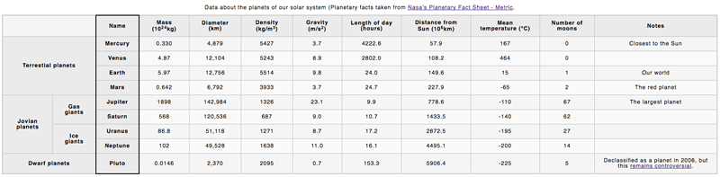

## A table with pair-programming
  
  This table contains info about the solar-system planets. created using the pair programming approach

## Build with

  - HTML
  - CSS

## How looks

  

## Acknowledgments

    - dariusdv for providing the necessary templates to complete this task.
## Made by 

    - sazukeR
    - Edjhernandez